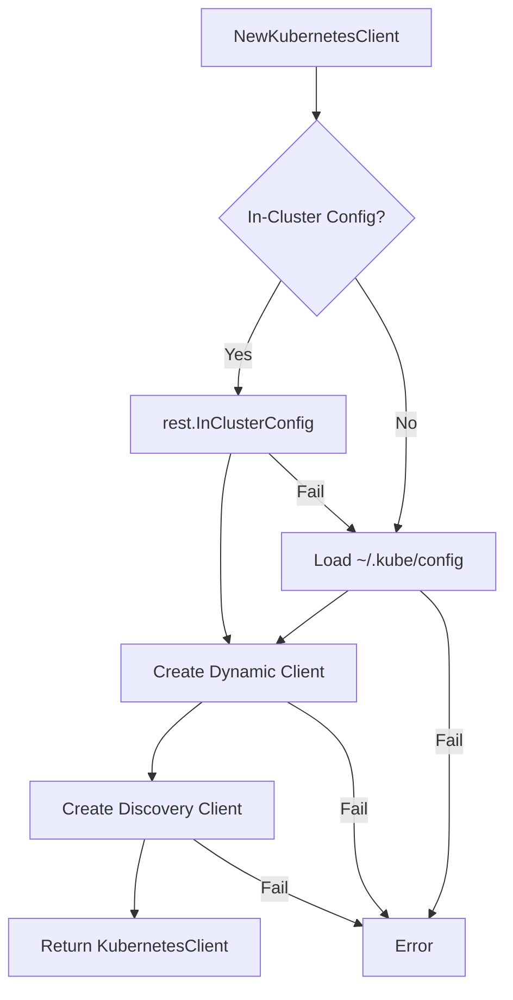
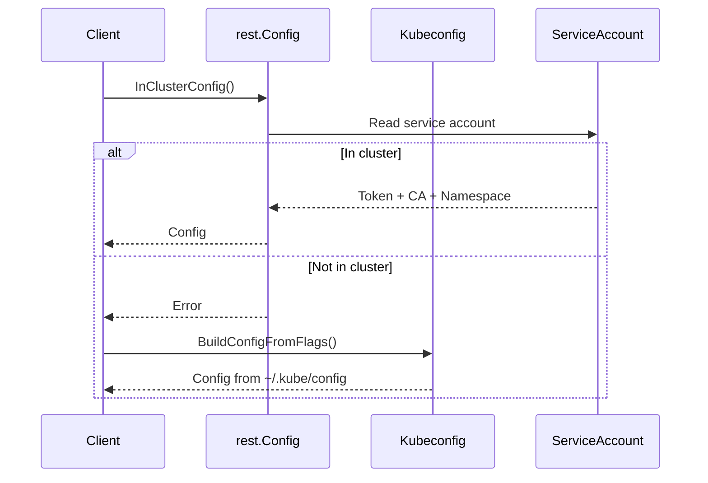
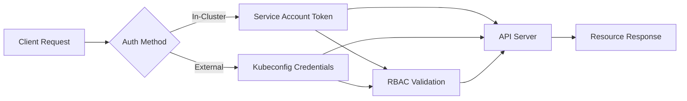

# Client Component

Kubernetes API client initialization and management.

## Structure

```go
type KubernetesClient struct {
    Dynamic   dynamic.Interface        // Resource operations
    Discovery discovery.DiscoveryInterface // API discovery
    Config    *rest.Config            // Cluster connection config
}
```

## Initialization Flow



## Configuration Sources

### In-Cluster Configuration
- **Path**: Service account token mounted at `/var/run/secrets/kubernetes.io/serviceaccount/`
- **Components**: CA certificate, namespace, token
- **Usage**: Pod deployment scenarios

### External Configuration
- **Environment Variable**: `KUBECONFIG` (highest priority)
- **Default Path**: `$HOME/.kube/config` (fallback)
- **Format**: Standard kubeconfig YAML
- **Usage**: Development, external tool execution, local clusters (kind, k3s, etc.)

**Priority Order**:
1. `KUBECONFIG` environment variable (if set)
2. `$HOME/.kube/config` (default)

**Example Usage**:
```bash
# Use custom kubeconfig
export KUBECONFIG=/path/to/custom/kubeconfig
./faro -config config.yaml

# Multiple kubeconfig contexts
export KUBECONFIG=~/.kube/config-prod:~/.kube/config-staging
```

## Client Interfaces

### Dynamic Client
- **Purpose**: Generic resource operations without compile-time type knowledge
- **Operations**: GET, LIST, CREATE, UPDATE, DELETE, PATCH, WATCH
- **Scope**: Both namespaced and cluster-scoped resources
- **Return Type**: `*unstructured.Unstructured`

### Discovery Client
- **Purpose**: Runtime API enumeration and metadata retrieval
- **Operations**: List API groups, resources, versions
- **Caching**: Built-in response caching for performance
- **Usage**: Resource validation, GVR resolution

## Error Handling

### Configuration Errors
- **In-cluster failure**: Automatic fallback to kubeconfig
- **Kubeconfig missing**: Explicit error with path information
- **Invalid credentials**: Authentication error propagation

### Client Creation Errors
- **Dynamic client failure**: Network connectivity, authorization issues
- **Discovery client failure**: API server accessibility problems
- **Configuration validation**: Malformed cluster configuration

## Dependencies

```
k8s.io/client-go/discovery  # API discovery operations
k8s.io/client-go/dynamic    # Generic resource client
k8s.io/client-go/rest       # Cluster connection configuration
k8s.io/client-go/tools/clientcmd # Kubeconfig parsing
```

## Usage Pattern

```go
client, err := NewKubernetesClient()
if err != nil {
    return fmt.Errorf("client initialization failed: %w", err)
}

// Dynamic resource operations
resource := client.Dynamic.Resource(gvr).Namespace(namespace)

// API discovery operations  
groups, err := client.Discovery.ServerGroups()
```

## Configuration Resolution



## Resource Access Patterns

### Namespaced Resources
```go
client.Dynamic.Resource(gvr).Namespace(ns).Get(name, metav1.GetOptions{})
```

### Cluster Resources
```go
client.Dynamic.Resource(gvr).Get(name, metav1.GetOptions{})
```

### List Operations
```go
client.Dynamic.Resource(gvr).Namespace(ns).List(metav1.ListOptions{})
```

## Authentication Flow



## Thread Safety

- **Dynamic Client**: Thread-safe for concurrent operations
- **Discovery Client**: Thread-safe with internal caching
- **Config Object**: Immutable after creation, safe for sharing

## Performance Characteristics

- **Connection Pooling**: Managed by underlying HTTP transport
- **Discovery Caching**: Automatic caching of API metadata
- **Request Timeout**: Configurable via rest.Config settings
- **Rate Limiting**: Client-side QPS and burst configuration support