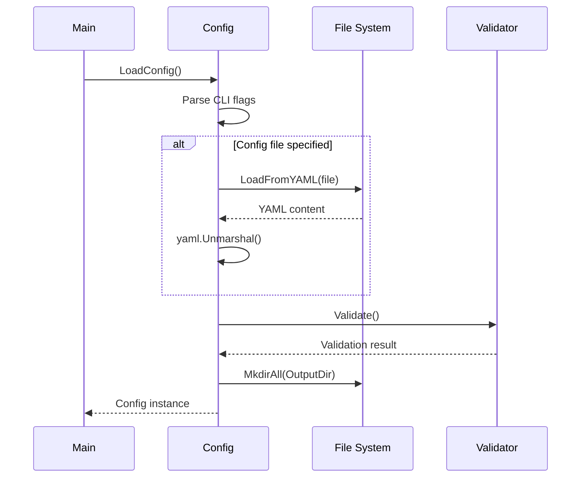
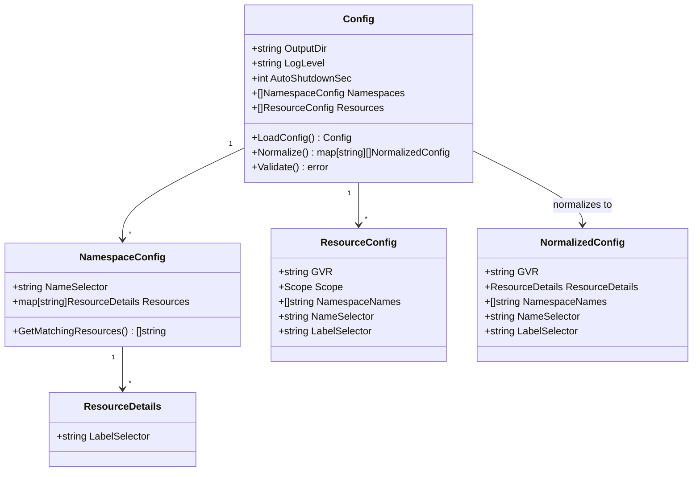

# Config Component

Configuration parsing, validation, and normalization system supporting dual format inputs.

## Core Types

```go
type Config struct {
    OutputDir       string            // Log and output directory
    LogLevel        string            // Logging verbosity level
    AutoShutdownSec int               // Timeout for automatic shutdown
    Namespaces      []NamespaceConfig // Namespace-centric format
    Resources       []ResourceConfig  // Resource-centric format
}

type NormalizedConfig struct {
    GVR               string          // Group/Version/Resource
    ResourceDetails   ResourceDetails // Filtering criteria (SERVER-SIDE only)
    NamespaceNames []string        // Literal namespace names only (for server-side filtering)
    NameSelector       string          // Exact name for resource name filtering (server-side)
    LabelSelector     string          // Kubernetes label selector for SERVER-SIDE filtering only
}
```

## Configuration Formats

### Namespace-Centric Format
```yaml
namespaces:
  - name_selector: "faro-test-1"  # Literal namespace name for server-side filtering
    resources:
      "v1/configmaps":
        name_selector: "test-config-1"  # Exact name for server-side field selector
        label_selector: "app=faro-test"  # Server-side label filtering
```

### Resource-Centric Format
```yaml
resources:
  - gvr: "v1/configmaps"
    scope: "Namespaced"
    namespace_names: ["faro-test-2"]  # Literal namespace names only
    name_selector: "test-config-1"        # Exact name for server-side filtering
    label_selector: "app=faro-test"      # Server-side label filtering
```

## Normalization Process

```mermaid
graph TD
    A[YAML Config] --> B{Format Type}
    B -->|Namespace-Centric| C[Process Namespaces]
    B -->|Resource-Centric| D[Process Resources]
    B -->|Both| E[Process Both Formats]
    
    C --> F[Create NormalizedConfig]
    D --> F
    E --> F
    
    F --> G[Group by GVR]
    G --> H[Return map[GVR][]NormalizedConfig]
    
    subgraph "Namespace Processing"
        C --> C1[For each namespace]
        C1 --> C2[For each resource in namespace]
        C2 --> C3[Create NormalizedConfig entry]
    end
    
    subgraph "Resource Processing"
        D --> D1[For each resource]
        D1 --> D2[Determine namespace selectors]
        D2 --> D3[Create NormalizedConfig entry]
    end
```

## Configuration Loading



## Data Structure Relationships



## Scope Handling

```go
type Scope string

const (
    ClusterScope    Scope = "Cluster"    // Cluster-scoped resources
    NamespaceScope  Scope = "Namespaced" // Namespace-scoped resources
)
```

### Cluster-Scoped Resources
- **Namespace Patterns**: Single empty string `[""]`
- **Examples**: `v1/nodes`, `v1/namespaces`, `rbac.authorization.k8s.io/v1/clusterroles`
- **Access Pattern**: No namespace specification in API calls

### Namespace-Scoped Resources
- **Namespace Patterns**: Literal namespace names only for server-side filtering
- **Examples**: `v1/pods`, `v1/services`, `apps/v1/deployments`
- **Access Pattern**: Requires namespace specification in API calls

## Validation Rules

### Basic Validation
- **Output Directory**: Must be valid filesystem path
- **Log Level**: Must be one of: debug, info, warning, error, fatal
- **Auto Shutdown**: Non-negative integer (0 = infinite)

### Configuration Format Validation
- **Mutual Exclusivity**: Not enforced - both formats can coexist
- **Empty Configuration**: Error if no namespaces or resources specified
- **Server-Side Filtering**: All filtering done via Kubernetes API server

### GVR Format Validation
- **Pattern**: `group/version/resource` or `version/resource` for core API
- **Examples**: `apps/v1/deployments`, `v1/pods`, `apiextensions.k8s.io/v1/customresourcedefinitions`

## Server-Side Filtering

Faro implements **server-side filtering only** using Kubernetes API capabilities:

### Label Selector (Kubernetes Standard)

Uses standard Kubernetes label selector syntax for server-side filtering:

```yaml
# Namespace-centric format
namespaces:
  - name_selector: "faro-test-1"  # Literal namespace name
    resources:
      "v1/configmaps":
        name_selector: "test-config-1"        # Exact name for field selector
        label_selector: "app=faro-test"      # Server-side label filtering
```

**Kubernetes Label Selector Syntax:**
- **Equality**: `app=nginx`
- **Inequality**: `app!=apache`  
- **Set-based**: `environment in (production,staging)`
- **Existence**: `app`
- **Non-existence**: `!app`
- **Multiple conditions**: `app=nginx,tier=frontend`

**Server-Side Filtering Benefits:**
- **API Server Processing**: The Kubernetes API server receives requests and performs filtering based on selectors, only retrieving resources that match criteria
- **etcd Efficiency**: The etcd database backing the API server is designed for efficient key lookups and watches, handling filtered requests without transmitting entire datasets
- **Network Optimization**: Only matching resources are transferred from API server to client, reducing bandwidth usage
- **Memory Efficiency**: Client applications receive only relevant data, minimizing memory footprint
- **Faro Core Efficiency**: No client-side pattern matching or filtering logic required in Faro core (applications may implement additional filtering)
- **Scalability**: Performance scales with filtered results, not total cluster resources
- **Implementation**: Applied via `ListOptions.LabelSelector` and `ListOptions.FieldSelector`
- **Faro Core Behavior**: All events matching server-side filters are forwarded to application handlers (confirmed by integration tests)

### Field Selector (Exact Name Matching)

For exact resource name matches, Faro uses Kubernetes field selectors:

```yaml
resources:
  - gvr: "v1/configmaps"
    scope: "Namespaced"
    namespace_names: ["faro-test-2"]  # Literal namespace names
    name_selector: "test-config-1"        # Creates metadata.name=test-config-1 field selector
    label_selector: "app=faro-test"      # Server-side label filtering
```

**Field Selector Implementation:**
- **Format**: `metadata.name=exact-value`
- **Server-Side**: Applied at Kubernetes API level
- **Performance**: Optimal network and processing efficiency
- **Limitation**: Only exact matches supported (no wildcards or regex)

## Command Line Interface

### Flags
```bash
--config string           # YAML configuration file path
--output-dir string       # Output directory (default "./output")
--log-level string        # Log level (default "info")
--auto-shutdown int       # Auto-shutdown seconds (default 0)
--help, -h               # Show help
```

### Precedence
1. **Command line flags**: Highest priority
2. **YAML file values**: Override defaults
3. **Default values**: Fallback values

## Error Handling

### Configuration Errors
- **File Not Found**: Clear error with attempted path
- **YAML Parse Error**: Line and column information
- **Validation Error**: Specific field and constraint information

### Server-Side Filtering Errors
- **Invalid Label Selector**: Kubernetes API validation errors
- **Invalid Field Selector**: Field selector syntax validation
- **Graceful Degradation**: Skip invalid selectors, continue with valid ones
- **Logging**: Warning messages for invalid selector selectors

## Performance Characteristics

### Server-Side Filtering Architecture

**Kubernetes API Server Processing:**
1. **Request Reception**: API server receives LIST/WATCH requests with selector parameters
2. **etcd Query Construction**: Server builds efficient queries based on label and field selectors
3. **Filtered Retrieval**: Only resources matching criteria are retrieved from etcd storage
4. **Selective Transmission**: API server transmits only matching resources to Faro client
5. **Watch Optimization**: Subsequent watch events are pre-filtered before network transmission

**etcd Database Efficiency:**
- **Key-Value Design**: etcd's architecture enables efficient key lookups and range queries for resource filtering
- **Index Utilization**: Label and field selectors leverage etcd's built-in indexing capabilities
- **Watch Streams**: Native support for filtered watch streams reduces unnecessary data transfer
- **Memory Conservation**: Server-side filtering prevents loading entire resource sets into API server memory

**Performance Benefits:**
- **Network Efficiency**: Only matching resources transferred from API server to client
- **Faro Core CPU Efficiency**: No client-side pattern matching, regex processing, or filtering logic required in Faro core
- **Memory Efficiency**: Reduced object storage and processing overhead in client applications
- **Scalability**: Performance scales with filtered results, not total cluster resource count
- **Bandwidth Conservation**: Eliminates transmission of irrelevant resources across network