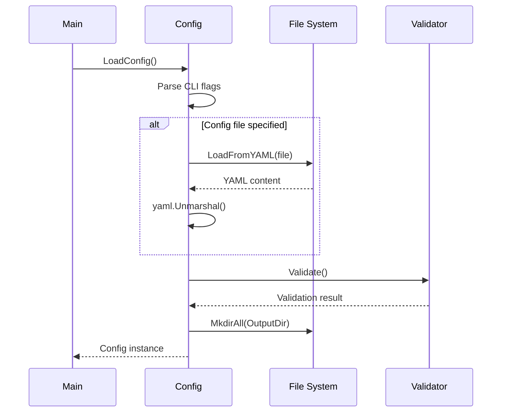
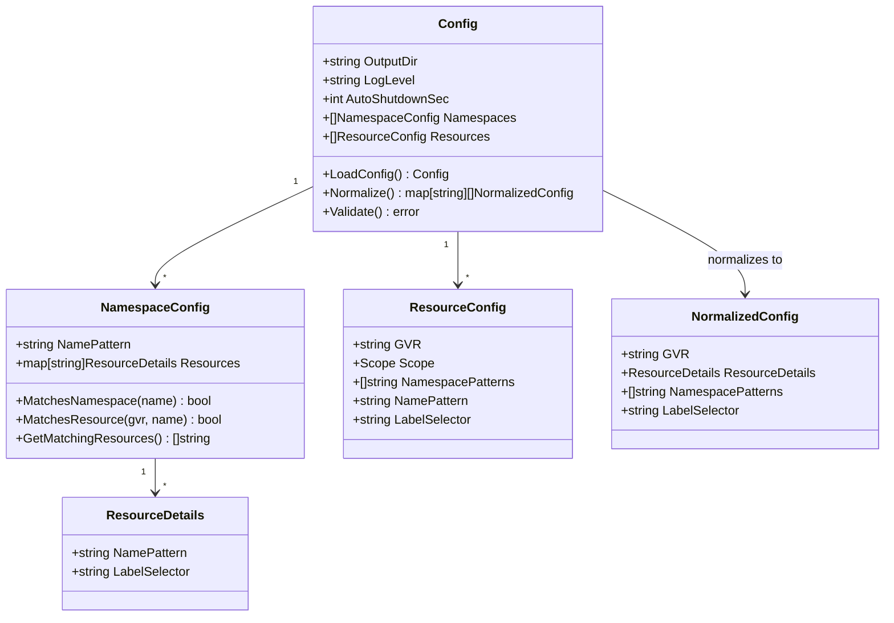

# Config Component

Configuration parsing, validation, and normalization system supporting dual format inputs.

## Core Types

```go
type Config struct {
    OutputDir       string            // Log and output directory
    LogLevel        string            // Logging verbosity level
    AutoShutdownSec int               // Timeout for automatic shutdown
    Namespaces      []NamespaceConfig // Namespace-centric format
    Resources       []ResourceConfig  // Resource-centric format
}

type NormalizedConfig struct {
    GVR               string          // Group/Version/Resource
    ResourceDetails   ResourceDetails // Filtering criteria
    NamespacePatterns []string        // Namespace regex patterns
    LabelSelector     string          // Kubernetes label selector
}
```

## Configuration Formats

### Namespace-Centric Format
```yaml
namespaces:
  - name_pattern: "prod-.*"
    resources:
      "v1/pods":
        name_pattern: "web-.*"
        label_selector: "app=nginx"
```

### Resource-Centric Format
```yaml
resources:
  - gvr: "v1/pods"
    scope: "Namespaced"
    namespace_patterns: ["prod-.*"]
    name_pattern: "web-.*"
    label_selector: "app=nginx"
```

## Normalization Process

```mermaid
graph TD
    A[YAML Config] --> B{Format Type}
    B -->|Namespace-Centric| C[Process Namespaces]
    B -->|Resource-Centric| D[Process Resources]
    B -->|Both| E[Process Both Formats]
    
    C --> F[Create NormalizedConfig]
    D --> F
    E --> F
    
    F --> G[Group by GVR]
    G --> H[Return map[GVR][]NormalizedConfig]
    
    subgraph "Namespace Processing"
        C --> C1[For each namespace]
        C1 --> C2[For each resource in namespace]
        C2 --> C3[Create NormalizedConfig entry]
    end
    
    subgraph "Resource Processing"
        D --> D1[For each resource]
        D1 --> D2[Determine namespace patterns]
        D2 --> D3[Create NormalizedConfig entry]
    end
```

## Configuration Loading



## Data Structure Relationships



## Scope Handling

```go
type Scope string

const (
    ClusterScope    Scope = "Cluster"    // Cluster-scoped resources
    NamespaceScope  Scope = "Namespaced" // Namespace-scoped resources
)
```

### Cluster-Scoped Resources
- **Namespace Patterns**: Single empty string `[""]`
- **Examples**: `v1/nodes`, `v1/namespaces`, `rbac.authorization.k8s.io/v1/clusterroles`
- **Access Pattern**: No namespace specification in API calls

### Namespace-Scoped Resources
- **Namespace Patterns**: Regex patterns or `[".*"]` for all namespaces
- **Examples**: `v1/pods`, `v1/services`, `apps/v1/deployments`
- **Access Pattern**: Requires namespace specification in API calls

## Validation Rules

### Basic Validation
- **Output Directory**: Must be valid filesystem path
- **Log Level**: Must be one of: debug, info, warning, error, fatal
- **Auto Shutdown**: Non-negative integer (0 = infinite)

### Configuration Format Validation
- **Mutual Exclusivity**: Not enforced - both formats can coexist
- **Empty Configuration**: Error if no namespaces or resources specified
- **Regex Patterns**: Compiled and validated at load time

### GVR Format Validation
- **Pattern**: `group/version/resource` or `version/resource` for core API
- **Examples**: `apps/v1/deployments`, `v1/pods`, `apiextensions.k8s.io/v1/customresourcedefinitions`

## Regex Pattern Matching

```go
// Namespace pattern matching
matched, err := regexp.MatchString(nsConfig.NamePattern, namespaceName)

// Resource name pattern matching  
matched, err := regexp.MatchString(details.NamePattern, resourceName)
```

### Pattern Examples
- **Exact Match**: `"production"`
- **Prefix Match**: `"prod-.*"`
- **Suffix Match**: `".*-prod"`
- **Wildcard**: `".*"`
- **Complex**: `"^(prod|stage)-web-[0-9]+$"`

## Label Selector Support

### Kubernetes Label Selector Syntax
- **Equality**: `app=nginx`
- **Inequality**: `app!=apache`
- **Set-based**: `environment in (production,staging)`
- **Existence**: `app`
- **Non-existence**: `!app`

### Server-Side Filtering
- Applied via `ListOptions.LabelSelector`
- Processed by Kubernetes API server
- Reduces network traffic and client-side processing

## Command Line Interface

### Flags
```bash
--config string           # YAML configuration file path
--output-dir string       # Output directory (default "./output")
--log-level string        # Log level (default "info")
--auto-shutdown int       # Auto-shutdown seconds (default 0)
--help, -h               # Show help
```

### Precedence
1. **Command line flags**: Highest priority
2. **YAML file values**: Override defaults
3. **Default values**: Fallback values

## Error Handling

### Configuration Errors
- **File Not Found**: Clear error with attempted path
- **YAML Parse Error**: Line and column information
- **Validation Error**: Specific field and constraint information

### Regex Compilation Errors
- **Invalid Pattern**: Error during pattern matching operations
- **Graceful Degradation**: Skip invalid patterns, continue with valid ones
- **Logging**: Warning messages for invalid regex patterns

## Pattern Matching Performance

### Regex Compilation
- **Compilation**: Performed during pattern matching operations
- **Caching**: No built-in caching - compiled per match
- **Performance Impact**: Negligible for typical configuration sizes

### Optimization Opportunities
- **Pre-compilation**: Store compiled regex objects
- **Pattern Simplification**: Use string operations for simple patterns
- **Caching**: Cache match results for repeated evaluations