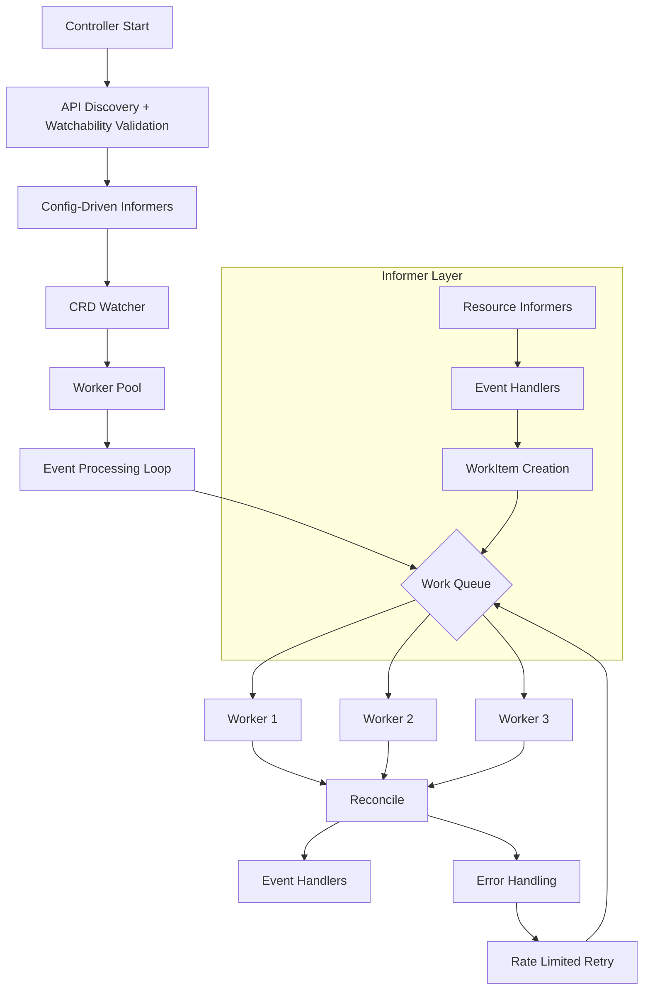
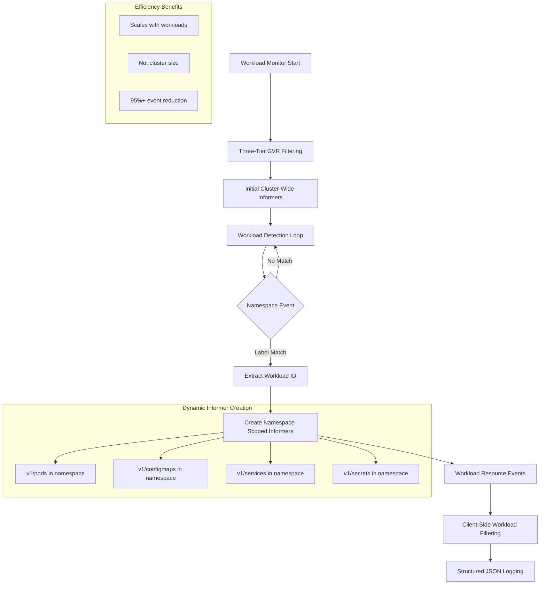
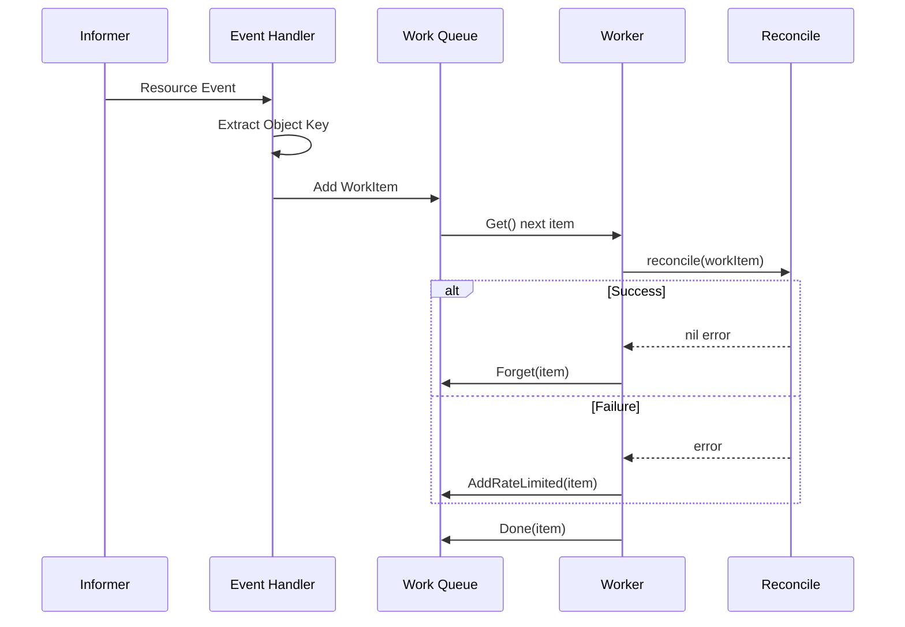
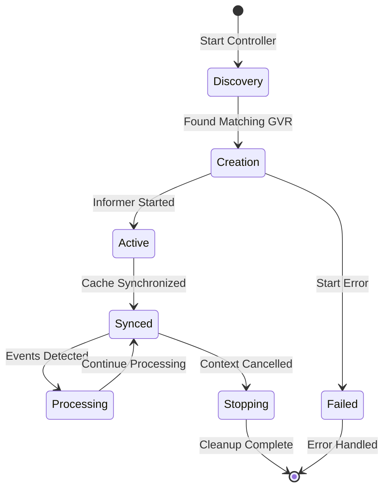
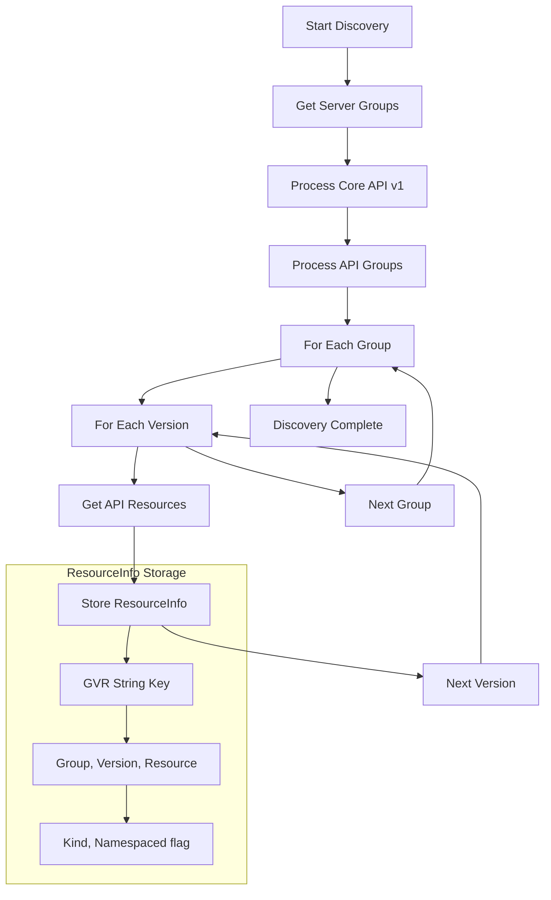
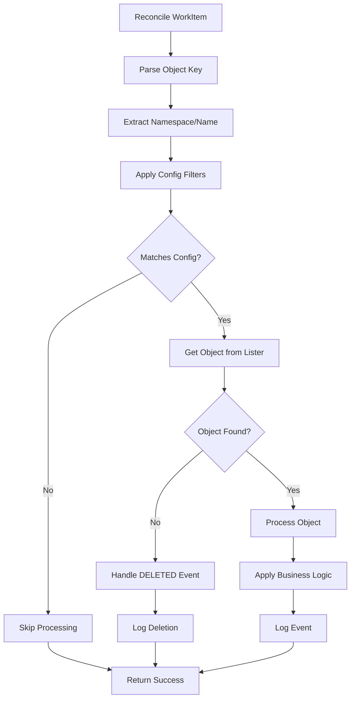
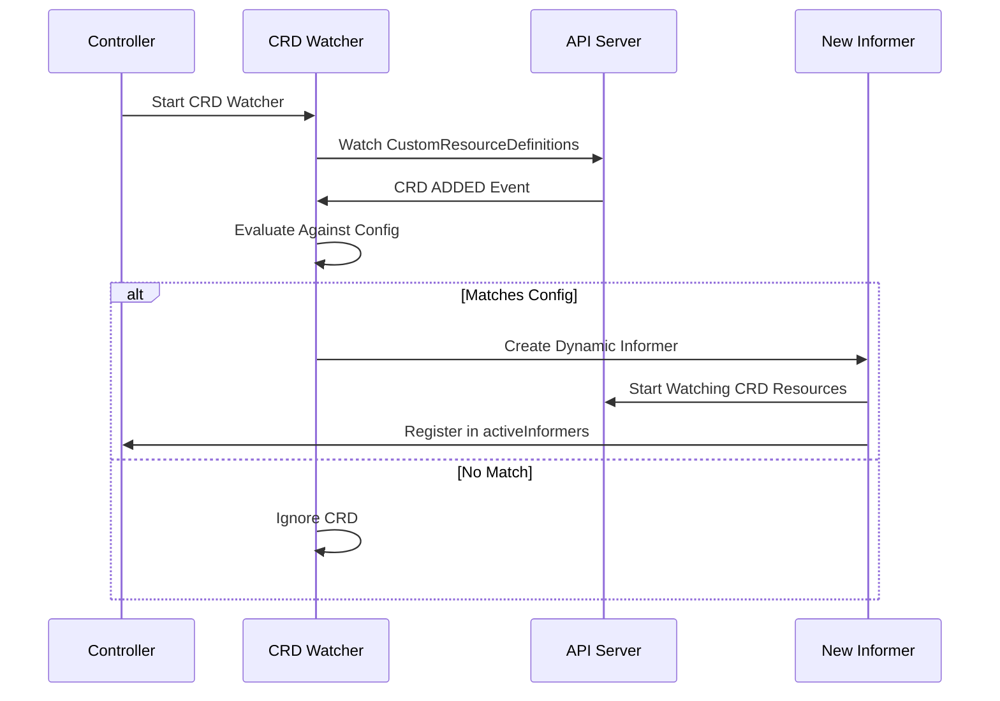

# Controller Component

Advanced Kubernetes informer controller with dynamic workload detection, three-tier filtering, and production-ready monitoring capabilities.

## Core Structure

### Core Library Controller
```go
type Controller struct {
    client *KubernetesClient
    logger *Logger
    config *Config
    
    // Context management
    ctx    context.Context
    cancel context.CancelFunc
    wg     sync.WaitGroup
    
    // Work queue system
    workQueue workqueue.RateLimitingInterface
    workers   int
    
    // Event handler interface
    eventHandlers []EventHandler
    handlersMu    sync.RWMutex
    
    // API discovery with watchability validation
    discoveredResources map[string]*ResourceInfo
    
    // Informer lifecycle
    cancellers      sync.Map  // GVR -> context.CancelFunc
    activeInformers sync.Map  // GVR -> bool
    listers         sync.Map  // GVR -> cache.GenericLister
    
    builtinCount int
}
```

### Workload Monitor Enhancement
```go
type WorkloadMonitor struct {
    client                   *faro.KubernetesClient
    logger                   *faro.Logger
    sharedController         *faro.Controller
    mu                       sync.RWMutex
    
    // Three-tier filtering configuration
    cmdAllowedGVRs           []string      // Cluster-wide monitoring
    cmdDeniedGVRs            []string      // Explicitly excluded
    cmdWorkloadGVRs          []string      // Per-namespace monitoring
    
    // Dynamic workload detection
    detectionLabel           string        // Label key for detection
    workloadNamePattern      *regexp.Regexp // Pattern matching
    namespacePattern         string        // Namespace relationships
    
    // State tracking
    detectedWorkloads        map[string]bool
    monitoredNamespaces      map[string]bool
    namespaceToWorkloadID    map[string]string
    workloadIDToWorkloadName map[string]string
}
```

## System Architecture

### Core Library Architecture


### Workload Monitor Architecture


## Work Queue System

### Queue Processing Flow


### Event Structures

#### Core Library Events
```go
type WorkItem struct {
    Key       string             // namespace/name or name
    GVRString string             // group/version/resource
    Configs   []NormalizedConfig // filtering rules
    EventType string             // ADDED/UPDATED/DELETED
}

type MatchedEvent struct {
    EventType string                      // ADDED/UPDATED/DELETED
    Object    *unstructured.Unstructured  // Full Kubernetes object
    GVR       string                      // Group/Version/Resource
    Key       string                      // namespace/name or name
    Config    NormalizedConfig            // Matched configuration
    Timestamp time.Time                   // Processing timestamp
}

type EventHandler interface {
    OnMatched(event MatchedEvent) error
}
```

#### Workload Monitor Events
```go
type WorkloadContext struct {
    WorkloadID   string            `json:"workload_id"`
    WorkloadName string            `json:"workload_name,omitempty"`
    Namespace    string            `json:"namespace,omitempty"`
    ResourceType string            `json:"resource_type"`
    ResourceName string            `json:"resource_name"`
    Action       string            `json:"action"`
    UID          string            `json:"uid,omitempty"`
    Labels       map[string]string `json:"labels,omitempty"`
}

type StructuredLogEntry struct {
    Timestamp time.Time       `json:"timestamp"`
    Level     string          `json:"level"`
    Message   string          `json:"message"`
    Workload  WorkloadContext `json:"workload"`
}
```

## Advanced Filtering System

### Three-Tier GVR Filtering (Workload Monitor)

Optimal resource efficiency through strategic GVR categorization:

```go
// filterGVRs applies three-tier filtering logic
func (w *WorkloadMonitor) filterGVRs(discoveredGVRs map[string]*faro.ResourceInfo) map[string]*faro.ResourceInfo {
    allowedGVRs := parseGVRList(w.cmdAllowedGVRs)
    workloadGVRs := parseGVRList(w.cmdWorkloadGVRs)
    deniedGVRs := append(parseGVRList(w.cmdDeniedGVRs), workloadGVRs...)
    
    filtered := make(map[string]*faro.ResourceInfo)
    for gvr, info := range discoveredGVRs {
        if len(allowedGVRs) > 0 {
            // ALLOWED MODE: Only monitor explicitly allowed GVRs
            if contains(allowedGVRs, gvr) {
                filtered[gvr] = info
            }
        } else {
            // DEFAULT MODE: Monitor all except denied GVRs
            if !contains(deniedGVRs, gvr) {
                filtered[gvr] = info
            }
        }
    }
    return filtered
}
```

#### Filtering Tiers

1. **Allowed GVRs** (Cluster-Wide Monitoring)
   - Minimal set for workload detection (typically just `v1/namespaces`)
   - Creates cluster-wide informers
   - Used for workload discovery and detection

2. **Workload GVRs** (Per-Namespace Monitoring)
   - Added to denied list to prevent cluster-wide monitoring
   - Creates namespace-scoped informers per detected workload
   - Optimal efficiency: scales with workloads, not cluster size

3. **Denied GVRs** (Explicit Exclusion)
   - High-volume, low-value resources
   - Noise reduction for better signal-to-noise ratio
   - Performance optimization

### Watchability Validation

Filters out non-watchable resources during API discovery:

```go
func isResourceWatchable(resource metav1.APIResource) bool {
    // Check for watch verb
    for _, verb := range resource.Verbs {
        if verb == "watch" {
            // Filter out known problematic resources
            problematicResources := []string{
                "componentstatuses", "bindings", "metrics.k8s.io",
                "metrics.k8s.io/v1beta1/nodes", "metrics.k8s.io/v1beta1/pods",
            }
            
            for _, problematic := range problematicResources {
                if strings.Contains(resource.Name, problematic) ||
                   strings.Contains(resource.Group, problematic) {
                    return false
                }
            }
            return true
        }
    }
    return false
}
```

### Dynamic Workload Detection

Label-based workload discovery with namespace pattern matching:

```go
func (w *WorkloadMonitor) handleNamespaceDetection(event faro.MatchedEvent) error {
    labels := event.Object.GetLabels()
    if labelValue, exists := labels[w.detectionLabel]; exists {
        if w.workloadNamePattern.MatchString(labelValue) {
            workloadID := extractWorkloadID(event.Object.GetName(), w.namespacePattern)
            w.addWorkloadToClientFiltering(workloadID, labelValue)
            return w.createNamespaceScopedInformers(workloadID)
        }
    }
    return nil
}
```

### Performance Benefits

| Approach | Informers | Events Processed | Efficiency |
|----------|-----------|------------------|------------|
| **Traditional Cluster-Wide** | 25 cluster-wide | 156,559 events | Baseline |
| **Workload Monitor** | 1 cluster + 15 namespace-scoped | 3,904 events | **97.5% reduction** |

## Informer Management

### Informer Lifecycle


### Key Management
- **Consistent Keys**: All maps use GVR string format `group/version/resource`
- **Deduplication**: One informer per GVR+namespace combination
- **Tracking**: Separate maps for cancellers, active status, and listers
- **Dynamic Creation**: Namespace-scoped informers created per detected workload
- **Lifecycle Management**: Automatic cleanup when workloads are removed

## API Discovery Process



### Resource Discovery Data
```go
type ResourceInfo struct {
    Group      string  // API group (empty for core)
    Version    string  // API version
    Resource   string  // Resource name (plural)
    Kind       string  // Resource kind (singular)
    Namespaced bool    // Scope determination
}
```

## Event Processing Pipeline

### Event Handler Design
```go
func (c *Controller) handleUnifiedNormalizedEvent(
    eventType string,
    obj *unstructured.Unstructured,
    gvrString string,
    normalizedConfigs []NormalizedConfig) {
    
    // Extract object key (only work in event handler)
    key, err := cache.MetaNamespaceKeyFunc(obj)
    if err != nil {
        c.logger.Error("controller", fmt.Sprintf("Failed to get key: %v", err))
        return
    }
    
    // Create and enqueue work item
    workItem := &WorkItem{
        Key:       key,
        GVRString: gvrString,
        Configs:   normalizedConfigs,
        EventType: eventType,
    }
    
    c.workQueue.Add(workItem)
}
```

### Worker Processing Logic
```go
func (c *Controller) runWorker() {
    defer c.wg.Done()
    for c.processNextWorkItem() {
        // Continue processing until shutdown
    }
}

func (c *Controller) processNextWorkItem() bool {
    obj, shutdown := c.workQueue.Get()
    if shutdown {
        return false
    }
    defer c.workQueue.Done(obj)
    
    workItem := obj.(*WorkItem)
    if err := c.reconcile(workItem); err != nil {
        c.workQueue.AddRateLimited(workItem)  // Retry with backoff
        return true
    }
    
    c.workQueue.Forget(workItem)  // Success
    return true
}
```

## Reconciliation Logic

### Object Key Filtering


### Filtering Implementation
```go
func (c *Controller) matchesConfigByKey(namespace, name string, config NormalizedConfig) bool {
    // Name pattern matching
    if config.ResourceDetails.NamePattern != "" {
        matched, err := regexp.MatchString(config.ResourceDetails.NamePattern, name)
        if err != nil || !matched {
            return false
        }
    }
    
    // Namespace pattern matching
    if namespace != "" && len(config.NamespacePatterns) > 0 {
        namespaceMatched := false
        for _, nsPattern := range config.NamespacePatterns {
            if matched, err := regexp.MatchString(nsPattern, namespace); err == nil && matched {
                namespaceMatched = true
                break
            }
        }
        if !namespaceMatched {
            return false
        }
    }
    
    return true
}
```

## Dynamic CRD Handling

### CRD Watcher Flow


## Error Handling Strategy

### Rate Limiting
- **Default Controller**: `workqueue.DefaultControllerRateLimiter()`
- **Exponential Backoff**: Increasing delays for repeated failures
- **Maximum Retries**: Configurable retry limits
- **Forget Policy**: Success removes item from rate limiter

### Failure Recovery
```go
if err := c.reconcile(workItem); err != nil {
    c.workQueue.AddRateLimited(workItem)  // Exponential backoff
    c.logger.Error("controller", fmt.Sprintf("Error processing %s: %v", workItem.Key, err))
    return true  // Continue processing other items
}
```

## Graceful Shutdown

### Shutdown Sequence
```mermaid
graph TD
    A[Stop() Called] --> B[Cancel Main Context]
    B --> C[Shutdown Work Queue]
    C --> D[Cancel All Informers]
    D --> E[Wait for Workers]
    E --> F{Timeout?}
    F -->|No| G[Clean Shutdown]
    F -->|Yes| H[Force Shutdown]
    G --> I[Log Success]
    H --> J[Log Warning]
```

### Resource Cleanup
```go
func (c *Controller) Stop() {
    c.cancel()                    // Stop all informers
    c.workQueue.ShutDown()        // Stop accepting new work
    
    // Cancel dynamic informers
    c.cancellers.Range(func(key, value interface{}) bool {
        if cancel, ok := value.(context.CancelFunc); ok {
            cancel()
        }
        return true
    })
    
    // Wait with timeout
    done := make(chan struct{})
    go func() {
        c.wg.Wait()
        close(done)
    }()
    
    select {
    case <-done:
        // Clean shutdown
    case <-time.After(25 * time.Second):
        // Timeout protection
    }
}
```

## Library Interface

### Event Handler Registration
```go
func (c *Controller) AddEventHandler(handler EventHandler) {
    c.handlersMu.Lock()
    defer c.handlersMu.Unlock()
    c.eventHandlers = append(c.eventHandlers, handler)
}
```

### Event Processing Pipeline
```go
// In processObject() after filtering match:
matchedEvent := MatchedEvent{
    EventType: eventType,
    Object:    obj,
    GVR:       gvrString,
    Key:       key,
    Config:    config,
    Timestamp: time.Now(),
}

// Call registered handlers concurrently
c.handlersMu.RLock()
handlers := c.eventHandlers
c.handlersMu.RUnlock()

for _, handler := range handlers {
    go func(h EventHandler, event MatchedEvent) {
        if err := h.OnMatched(event); err != nil {
            c.logger.Warning("controller", fmt.Sprintf("Event handler failed: %v", err))
        }
    }(handler, matchedEvent)
}
```

## Concurrency Model

### Thread Safety
- **Work Queue**: Thread-safe operations for multiple workers
- **Sync.Map**: Concurrent access to informer metadata
- **Context Cancellation**: Safe informer lifecycle management
- **Wait Groups**: Coordinated goroutine shutdown
- **Library Handlers**: Called asynchronously in separate goroutines

### Worker Pool Management
- **Default Workers**: 3 goroutines
- **Work Distribution**: Round-robin via work queue
- **Load Balancing**: Automatic via queue blocking operations
- **Scalability**: Configurable worker count

## Performance Characteristics

### Memory Management
- **Object Caching**: Managed by informer listers
- **Work Queue**: Bounded queue with overflow protection
- **Resource Cleanup**: Explicit cleanup on informer shutdown

### Network Optimization
- **Efficient Watches**: Single watch per GVR regardless of config rules
- **Server-side Filtering**: Label selectors applied at API server
- **Connection Reuse**: Shared HTTP connections via client-go