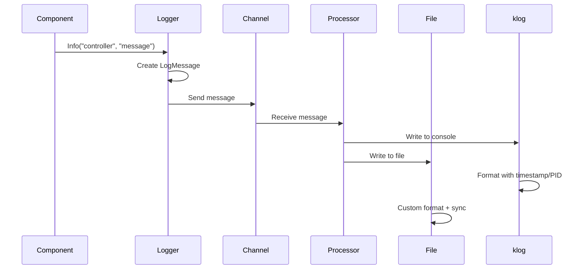

# Logger Component

Callback-based logging system with pluggable handlers and comprehensive log level control.

## Core Structure

```go
type Logger struct {
    handlers []LogHandler
    mu       sync.RWMutex
}

type LogHandler interface {
    WriteLog(level int, component, message string, timestamp time.Time) error
    Name() string
    Close() error
}

type ConsoleLogHandler struct{}
type FileLogHandler struct {
    file *os.File
    mu   sync.Mutex
}
```

## Logging Architecture

```mermaid
graph TD
    A[Component] --> B[Logger.Log()]
    B --> C[Create Message]
    C --> D[Iterate Handlers]
    
    D --> E[ConsoleLogHandler]
    D --> F[FileLogHandler]
    D --> G[Custom Handlers...]
    
    E --> H[klog Output]
    F --> I[File Output]
    G --> J[External Systems]
    
    H --> K[Terminal/Console]
    I --> L[Timestamped Log File]
    J --> M[Monitoring/Alerts]
```

## Message Flow



## Initialization Process

### Logger Creation
```go
func NewLogger(config *Config) (*Logger, error) {
    logger := &Logger{
        handlers: make([]LogHandler, 0),
    }
    
    // Configure klog verbosity based on log level
    // This ensures debug messages are only shown when log level is debug
    if config.LogLevel == "debug" {
        flag.Set("v", "1") // Enable klog verbosity level 1 for debug messages
    } else {
        flag.Set("v", "0") // Disable debug verbosity for non-debug levels
    }
    
    // Always add console handler
    logger.AddHandler(&ConsoleLogHandler{})
    
    // Add file handler if logDir specified
    logDir := config.GetLogDir()
    if logDir != "" {
        if err := os.MkdirAll(logDir, 0755); err != nil {
            return nil, fmt.Errorf("failed to create log directory: %v", err)
        }
        
        timestamp := time.Now().Format("20060102-150405")
        logPath := fmt.Sprintf("%s/faro-%s.log", logDir, timestamp)
        
        fileHandler, err := NewFileLogHandler(logPath)
        if err != nil {
            return nil, fmt.Errorf("failed to create file handler: %v", err)
        }
        logger.AddHandler(fileHandler)
        
        // Add JSON handler if requested
        if config.JsonExport {
            jsonPath := fmt.Sprintf("%s/events-%s.json", logDir, timestamp)
            jsonHandler, err := NewJSONFileHandler(jsonPath)
            if err != nil {
                return nil, fmt.Errorf("failed to create JSON handler: %v", err)
            }
            logger.AddHandler(jsonHandler)
        }
    }
    
    return logger, nil
}
```

### File Naming Convention
- **Format**: `faro-YYYYMMDD-HHMMSS.log`
- **Example**: `faro-20240809-143052.log`
- **Location**: Configurable output directory

## Message Processing

### Handler Processing
```go
func (l *Logger) Log(level int, component, message string) {
    timestamp := time.Now()
    
    l.mu.RLock()
    handlers := l.handlers
    l.mu.RUnlock()
    
    for _, handler := range handlers {
        if err := handler.WriteLog(level, component, message, timestamp); err != nil {
            klog.Errorf("Log handler '%s' failed: %v", handler.Name(), err)
        }
    }
}
```

### Handler Management
```go
func (l *Logger) AddHandler(handler LogHandler) {
    l.mu.Lock()
    defer l.mu.Unlock()
    l.handlers = append(l.handlers, handler)
}

func (l *Logger) RemoveHandler(name string) {
    l.mu.Lock()
    defer l.mu.Unlock()
    for i, handler := range l.handlers {
        if handler.Name() == name {
            l.handlers = append(l.handlers[:i], l.handlers[i+1:]...)
            handler.Close()
            break
        }
    }
}
```

## Dual Output System

### Console Output (via klog)
```go
// klog handles timestamp, PID, filename automatically
switch msg.Level {
case -1: // Debug
    klog.V(1).Info(logLine)
case 0:  // Info
    klog.Info(logLine)
case 1:  // Warning
    klog.Warning(logLine)
case 2:  // Error
    klog.Error(logLine)
case 3:  // Fatal
    klog.Fatal(logLine)
}
```

### File Output (Custom Format)
```go
// Custom format matching klog style
timestamp := msg.Timestamp.Format("0102 15:04:05.000000")
pid := os.Getpid()
levelChar := getLevelChar(msg.Level) // D, I, W, E, F
fileLogLine := fmt.Sprintf("%s%s %d] %s", levelChar, timestamp, pid, logLine)
l.logFile.WriteString(fmt.Sprintf("%s\n", fileLogLine))
l.logFile.Sync() // Force immediate write
```

## Log Level Control

### How It Works
The logger controls klog verbosity based on the configuration:

```mermaid
graph TD
    A[Config.LogLevel] --> B{Level Check}
    B -->|debug| C[flag.Set v=1]
    B -->|info/warning/error| D[flag.Set v=0]
    
    C --> E[klog.V(1).Info shows debug]
    D --> F[klog.V(1).Info hidden]
    
    E --> G[Console shows debug messages]
    F --> H[Console hides debug messages]
    
    G --> I[All levels written to file]
    H --> I
```

### Configuration Examples
```go
// Clean console output - debug messages hidden
config := &faro.Config{LogLevel: "info"}
logger, _ := faro.NewLogger(config)  // Sets klog verbosity to 0

// Verbose console output - debug messages shown
config := &faro.Config{LogLevel: "debug"}  
logger, _ := faro.NewLogger(config)  // Sets klog verbosity to 1
```

## Log Levels

```mermaid
graph LR
    A[-1 Debug] --> B[0 Info]
    B --> C[1 Warning]
    C --> D[2 Error]
    D --> E[3 Fatal]
    
    subgraph "Console Mapping"
        A --> F[klog.V(1).Info]
        B --> G[klog.Info]
        C --> H[klog.Warning]
        D --> I[klog.Error]
        E --> J[klog.Fatal]
    end
    
    subgraph "File Prefix"
        A --> K[D]
        B --> L[I]
        C --> M[W]
        D --> N[E]
        E --> O[F]
    end
    
    subgraph "Verbosity Control"
        F --> L1[Shown only if v>=1]
        G --> L2[Always shown]
        H --> L3[Always shown]
        I --> L4[Always shown]
        J --> L5[Always shown]
    end
```

## API Interface

### Logging Methods
```go
func (l *Logger) Debug(component, message string)   // Level -1
func (l *Logger) Info(component, message string)    // Level 0
func (l *Logger) Warning(component, message string) // Level 1
func (l *Logger) Error(component, message string)   // Level 2
func (l *Logger) Fatal(component, message string)   // Level 3
```

### Usage Pattern
```go
logger.Info("controller", "Starting informer for v1/pods")
logger.Debug("discovery", fmt.Sprintf("Found %d resources", count))
logger.Error("client", fmt.Sprintf("Failed to connect: %v", err))
```

## Component Identification

### Component Names
- **controller**: Main controller operations
- **discovery**: API resource discovery
- **client**: Kubernetes client operations
- **main**: Application lifecycle
- **config**: Configuration parsing

### Message Format
```
[component] message content
```

**Example**: `[controller] Starting multi-layered informer controller`

## Performance Characteristics

### Handler Processing
- **Synchronous**: Direct handler calls (no buffering/channels)
- **Reliability**: No message loss from buffer overflows
- **Thread Safety**: RWMutex protects handler list

### I/O Operations
- **File Sync**: Immediate sync after each write
- **Console Output**: Managed by klog buffering
- **Error Handling**: Handler failures logged but don't block

## Graceful Shutdown

### Shutdown Sequence
```mermaid
graph TD
    A[Shutdown() Called] --> B[Close All Handlers]
    B --> C[Flush klog Buffers]
    C --> D[Complete]
```

### Implementation
```go
func (l *Logger) Shutdown() {
    l.mu.Lock()
    defer l.mu.Unlock()
    
    for _, handler := range l.handlers {
        if err := handler.Close(); err != nil {
            klog.Errorf("Failed to close handler '%s': %v", handler.Name(), err)
        }
    }
    
    klog.Flush()  // Ensure all console output written
}
```

## Error Handling

### Handler Failures
- **Isolation**: Individual handler failures don't affect others
- **Logging**: Handler errors logged via klog.Errorf
- **Continuation**: Failed handlers don't block message processing

### File Write Errors
- **Error Reporting**: File write errors returned and logged
- **Console Fallback**: Console handler continues independently
- **File Sync**: Explicit sync ensures data persistence

## Thread Safety

### Concurrent Access
- **Handler List**: Protected by RWMutex
- **Handler Calls**: Individual handlers must be thread-safe
- **klog Integration**: Thread-safe klog operations

### Synchronization
- **RWMutex**: Reader-writer lock for handler list access
- **Handler Design**: Each handler manages its own synchronization
- **No Channels**: Eliminates channel-related race conditions

## Integration Points

### klog Configuration
- **Verbosity**: Controlled via klog flags
- **Output Format**: Standard klog formatting
- **Destination**: Configurable via klog (stderr by default)

### File System
- **Directory Creation**: Automatic creation with 0755 permissions
- **File Permissions**: 0644 (readable by owner/group, writable by owner)
- **Append Mode**: Safe for process restarts