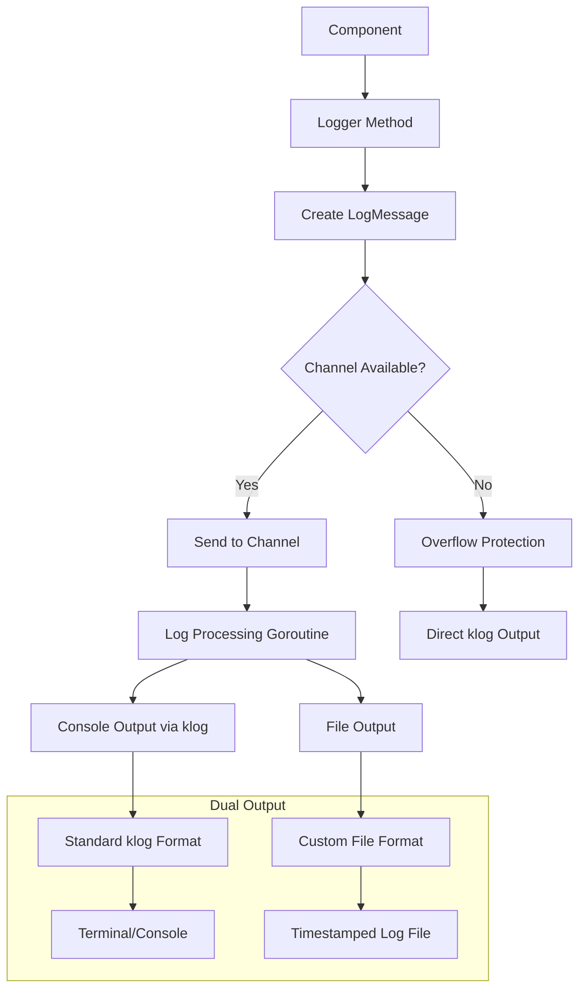
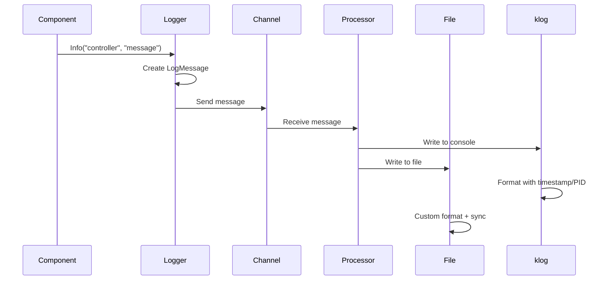

# Logger Component

Asynchronous channel-based logging system with dual output streams.

## Core Structure

```go
type Logger struct {
    logChan chan LogMessage     // Buffered channel for async processing
    logFile *os.File           // File handle for log output
    ctx     context.Context    // Cancellation context
    cancel  context.CancelFunc // Shutdown control
    wg      sync.WaitGroup     // Goroutine coordination
}

type LogMessage struct {
    Level     int    // klog levels: -1=Debug, 0=Info, 1=Warning, 2=Error, 3=Fatal
    Component string // Component identifier (e.g., "controller", "main")
    Message   string // Log message content
    Timestamp time.Time // Message creation time
}
```

## Logging Architecture



## Message Flow



## Initialization Process

### Logger Creation
```go
func NewLogger(logDir string) (*Logger, error) {
    // Create log directory
    if err := os.MkdirAll(logDir, 0755); err != nil {
        return nil, fmt.Errorf("failed to create log directory: %v", err)
    }
    
    // Generate timestamped filename
    timestamp := time.Now().Format("20060102-150405")
    logPath := fmt.Sprintf("%s/faro-%s.log", logDir, timestamp)
    
    // Open file for writing
    logFile, err := os.OpenFile(logPath, os.O_CREATE|os.O_WRONLY|os.O_APPEND, 0644)
    if err != nil {
        return nil, fmt.Errorf("failed to create log file: %v", err)
    }
    
    // Initialize logger with buffered channel
    logger := &Logger{
        logChan: make(chan LogMessage, 1000), // Buffer size: 1000 messages
        logFile: logFile,
        ctx:     ctx,
        cancel:  cancel,
    }
    
    // Start processing goroutine
    logger.wg.Add(1)
    go logger.processLogs()
    
    return logger, nil
}
```

### File Naming Convention
- **Format**: `faro-YYYYMMDD-HHMMSS.log`
- **Example**: `faro-20240809-143052.log`
- **Location**: Configurable output directory

## Message Processing

### Asynchronous Processing Loop
```go
func (l *Logger) processLogs() {
    defer l.wg.Done()
    
    for {
        select {
        case <-l.ctx.Done():
            // Graceful shutdown: drain remaining messages
            for {
                select {
                case msg := <-l.logChan:
                    l.writeLog(msg)
                default:
                    return
                }
            }
        case msg := <-l.logChan:
            l.writeLog(msg)
        }
    }
}
```

### Overflow Protection
```go
func (l *Logger) Log(level int, component, message string) {
    msg := LogMessage{
        Level:     level,
        Component: component,
        Message:   message,
        Timestamp: time.Now(),
    }
    
    select {
    case l.logChan <- msg:
        // Success: message queued
    default:
        // Channel full: use direct klog to prevent blocking
        klog.Errorf("[OVERFLOW] [%s] %s", component, message)
    }
}
```

## Dual Output System

### Console Output (via klog)
```go
// klog handles timestamp, PID, filename automatically
switch msg.Level {
case -1: // Debug
    klog.V(1).Info(logLine)
case 0:  // Info
    klog.Info(logLine)
case 1:  // Warning
    klog.Warning(logLine)
case 2:  // Error
    klog.Error(logLine)
case 3:  // Fatal
    klog.Fatal(logLine)
}
```

### File Output (Custom Format)
```go
// Custom format matching klog style
timestamp := msg.Timestamp.Format("0102 15:04:05.000000")
pid := os.Getpid()
levelChar := getLevelChar(msg.Level) // D, I, W, E, F
fileLogLine := fmt.Sprintf("%s%s %d] %s", levelChar, timestamp, pid, logLine)
l.logFile.WriteString(fmt.Sprintf("%s\n", fileLogLine))
l.logFile.Sync() // Force immediate write
```

## Log Levels

```mermaid
graph LR
    A[-1 Debug] --> B[0 Info]
    B --> C[1 Warning]
    C --> D[2 Error]
    D --> E[3 Fatal]
    
    subgraph "Console Mapping"
        A --> F[klog.V(1).Info]
        B --> G[klog.Info]
        C --> H[klog.Warning]
        D --> I[klog.Error]
        E --> J[klog.Fatal]
    end
    
    subgraph "File Prefix"
        A --> K[D]
        B --> L[I]
        C --> M[W]
        D --> N[E]
        E --> O[F]
    end
```

## API Interface

### Logging Methods
```go
func (l *Logger) Debug(component, message string)   // Level -1
func (l *Logger) Info(component, message string)    // Level 0
func (l *Logger) Warning(component, message string) // Level 1
func (l *Logger) Error(component, message string)   // Level 2
func (l *Logger) Fatal(component, message string)   // Level 3
```

### Usage Pattern
```go
logger.Info("controller", "Starting informer for v1/pods")
logger.Debug("discovery", fmt.Sprintf("Found %d resources", count))
logger.Error("client", fmt.Sprintf("Failed to connect: %v", err))
```

## Component Identification

### Component Names
- **controller**: Main controller operations
- **discovery**: API resource discovery
- **client**: Kubernetes client operations
- **main**: Application lifecycle
- **config**: Configuration parsing

### Message Format
```
[component] message content
```

**Example**: `[controller] Starting sophisticated multi-layered informer controller`

## Performance Characteristics

### Channel Buffering
- **Buffer Size**: 1000 messages
- **Overflow Behavior**: Direct klog output
- **Memory Usage**: ~100KB for full buffer (assuming 100 bytes per message)

### I/O Operations
- **File Sync**: Immediate sync after each write
- **Console Output**: Managed by klog buffering
- **Async Processing**: Non-blocking for application components

## Graceful Shutdown

### Shutdown Sequence
```mermaid
graph TD
    A[Shutdown() Called] --> B[Cancel Context]
    B --> C[Signal Processor to Stop]
    C --> D[Drain Remaining Messages]
    D --> E[Wait for Processor Goroutine]
    E --> F[Close Channel]
    F --> G[Close Log File]
    G --> H[Flush klog Buffers]
```

### Implementation
```go
func (l *Logger) Shutdown() {
    l.cancel()        // Stop accepting new messages
    l.wg.Wait()       // Wait for processor to finish
    close(l.logChan)  // Clean up channel
    if l.logFile != nil {
        l.logFile.Close()  // Close file handle
    }
    klog.Flush()      // Ensure all console output written
}
```

## Error Handling

### Channel Overflow
- **Detection**: Channel buffer full
- **Response**: Direct klog output with `[OVERFLOW]` prefix
- **Recovery**: Automatic when buffer space available

### File Write Errors
- **Silent Failure**: File write errors not propagated
- **Console Fallback**: klog output continues regardless
- **File Sync**: Explicit sync ensures data persistence

## Thread Safety

### Concurrent Access
- **Channel Operations**: Thread-safe Go channel
- **File Writing**: Single goroutine writer
- **klog Integration**: Thread-safe klog operations

### Synchronization
- **WaitGroup**: Ensures processor goroutine completion
- **Context Cancellation**: Coordinated shutdown signaling
- **Channel Closure**: Prevents writes after shutdown

## Integration Points

### klog Configuration
- **Verbosity**: Controlled via klog flags
- **Output Format**: Standard klog formatting
- **Destination**: Configurable via klog (stderr by default)

### File System
- **Directory Creation**: Automatic creation with 0755 permissions
- **File Permissions**: 0644 (readable by owner/group, writable by owner)
- **Append Mode**: Safe for process restarts